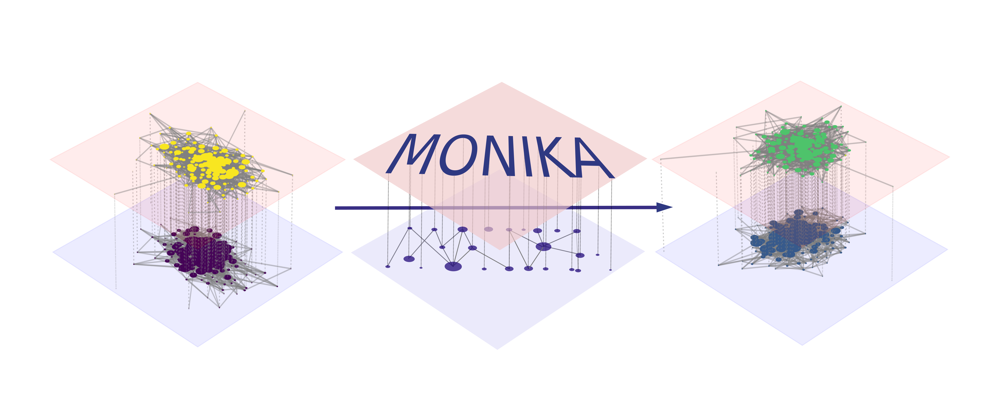

# MONIKA
## Multi-Omic Network Inference & Knockout Analysis
This tool performs both network inference and integration in a multi-omic setting. Following single layer inference via a prior-incorporating Gaussian Graphical Model, multiple layers are inferred via Bayesian sequential updating. 
Target nodes and biological pathways are identified via significance testing of knockouts and diffusion analysis.

The tool has been tested on colorectal cancer datasets.

read 'The big return' in obsidian vault

### PreProcess

#### mappingL4powerseries.py

  Scroll down to the part 'LINKEDOMICS LINKEDOMICS LINKEDOMICS' for current data
  Yeo-Johnson transform, normality and outlier checks etc.
  **Output**: proteomics and transcriptomics data matrices, split into cms123 and cmsALL for piglasso

### Networks

#### SCAFFOLD_TF_TFTBS_net.py

  find function STRING_adjacency_matrix which generates the prior (network-structured prior)
  **Output:** prior adjacency matrix for piglasso

#### piglasso.py

  **input** is omics matrices from mappingL4powerseries.py 
            and prior adjacency matrix from SCAFFOLD_TF_TFBS_net.py
  **Output:** edge_counts_all for various values of lambda (J) and subsampled matrices (Q)

#### numain.py  

  **input:** edge_counts_all from piglasso output, for proteomics, transcriptomics, cms123 and ALL
  Scroll down to 'OMICS DATA PART'
  ignore smooth_bool and man bool
  Here the end_slice bool checks whether we want to limit the lambda_range before the kneepoint calculation
  the function 'analysis' calculates the kneepoints, then estimates both lambda_np and lambda_wp from the estimate_lambdas module
  **Output:** adj_matrix, the omics network (x4)

### Diffusion

#### GDD_weighted_diffusion2.py

  !! note that it is v2 !!
  **Input:** Omics networks from numain.py
  weighted_multi_omics_graph connects the prot and trans layers, returning a weighted graph
  run_knockout_analysis creates knockdown graphs and calculates the GDD (max distance)

  results are collected in 'local_target_results' (search in file)
  They are structured as dictionaries:
    line 695 contains dictionary structure
    top level is target (node or pathway / set of nodes)
    next level is knockdown factor
    bottom level is gdd_values_trans, gddvalues_disrupt, max_gdd etc.)

  line 1089 performs significance tests for pathways
    1000 random permutations compared to the effect size of targeted pathways
    gdd_values disrupt and trans are compared here
    

  multiplex_net_viz creates a multiplex visualization using pymnet

 

### Future Directions
  read 'the big return' in vault
  Try using the TRRUST structure defined in SCAFFOLD_TF_TFTBS_net.py, make a pairwise model (See meething notes ## 21.12.23, and Defence Notes)
  
